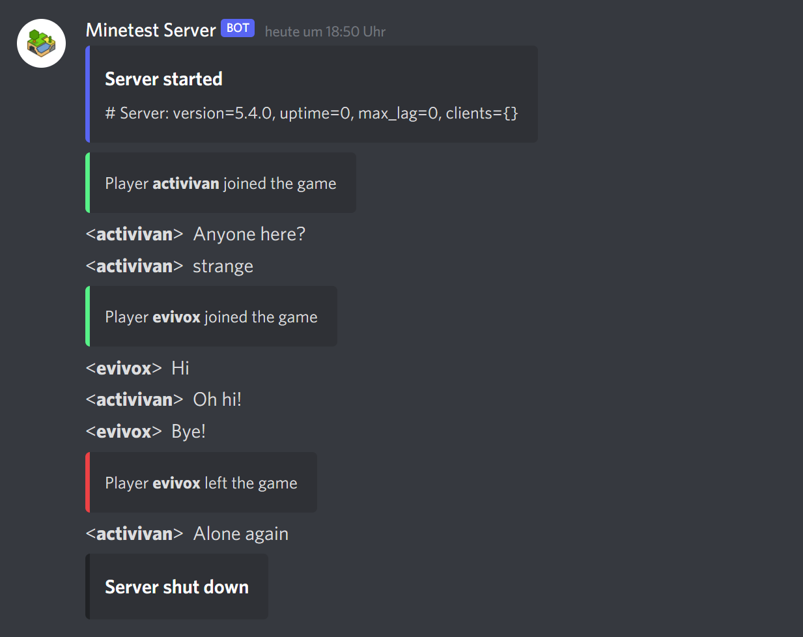

# Minetest Discord Webhook

*Version v2.0.0*

This Minetest mod allows you to mirror chat messages, server status updates and player connections to your Discord server. Unlike other mods, this one uses webhooks to directly post messages to Discord - there is no need to run a proxy or waste your time setting up a Discord bot, which makes getting started only a matter of seconds. On top of that, you can literally customize everything! What information you want to be mirrored, what color notification boxes should have, or in what way to style a player name - everything is up to you - and it's available in 7 different languages. Give it a try!



> [!WARNING]
> Version v2.0.0 comes with new setting keys. Please head to `settingtypes.txt` to learn more and update your settings!


## Getting started

### Install Minetest mod

To install this mod, you have two options:

* Clone this repository into the `minetest/mods` directory by executing

  ```shell
  git clone https://github.com/activivan/mt-dcwebhook.git
  ```

* Download this repository as an archive: https://github.com/activivan/mt-dcwebhook/archive/refs/heads/master.zip and extract the downloaded file into the `minetest/mods` directory. Rename the folder to `dcwebhook`


### Creating a Discord Webhook

1. Go to your Discord server settings
2. Go to "Integrations"
3. Go to "Webhooks" and create a new Webhook
4. Copy the URL of the webhook to your clipboard

### Configuring the mod

The Discord Webhook URL setting is the only one required for this mod to work. Paste the URL of the webhook you created into `minetest.conf`:

```conf
dcwebhook.url = https://discord.com/api/webhooks/blablabla
```

Optionally, set the language you want the system notifications to be in. Languages currently available: English: `en` (default), German: `de`, Russian: `ru`, Dutch: `nl`, French: `fr`, Spanish: `es` and Italian: `it`

```conf
dcwebhook.lang = de
```

### Add mod to http_mods

As this mod needs access to the Minetest HTTP API to work, it has to be added to the `secure.http_mods` property in the `minetest.conf` file. Alternatively, it can be added to `secure.trusted_mods`.

***Note:** Due to the need for the Minetest HTTP API, this mod only works on Minetest Servers built with cURL support*


## Customizing the mod

There are many different ways in which you can customize this mod. All available settings are listed in `settingtypes.txt`. Go check it out!


## Found a bug?

Please create a new issue on GitHub: https://github.com/activivan/mt-dcwebhook/issues


# License

MIT License

Copyright (c) 2021-2024 activivan <activivan.studios@gmail.com>

Permission is hereby granted, free of charge, to any person obtaining a copy of this software and associated documentation files (the  "Software"), to deal in the Software without restriction, including  without limitation the rights to use, copy, modify, merge, publish,  distribute, sublicense, and/or sell copies of the Software, and to  permit persons to whom the Software is furnished to do so, subject to  the following conditions:

The above copyright notice and this permission notice shall be included in all copies or substantial portions of the Software.

THE SOFTWARE IS PROVIDED "AS IS", WITHOUT WARRANTY OF ANY KIND,  EXPRESS OR IMPLIED, INCLUDING BUT NOT LIMITED TO THE WARRANTIES OF  MERCHANTABILITY, FITNESS FOR A PARTICULAR PURPOSE AND NONINFRINGEMENT.  IN NO EVENT SHALL THE AUTHORS OR COPYRIGHT HOLDERS BE LIABLE FOR ANY  CLAIM, DAMAGES OR OTHER LIABILITY, WHETHER IN AN ACTION OF CONTRACT,  TORT OR OTHERWISE, ARISING FROM, OUT OF OR IN CONNECTION WITH THE  SOFTWARE OR THE USE OR OTHER DEALINGS IN THE SOFTWARE.
